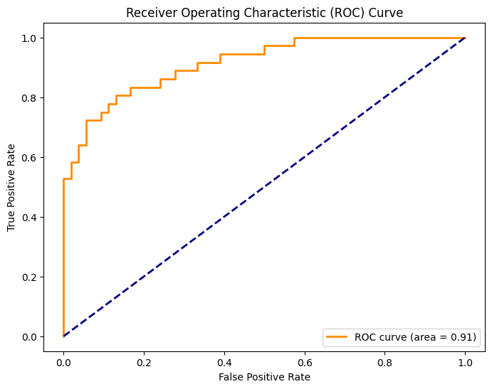

# Датасет Titanic

## Описание проекта
Этот проект был создан с целью обучения и развития навыков машинного обучения. Репозиторий содержит мое решение для Kaggle соревнования, посвященного прогнозированию выживания пассажиров на Титанике. Проект включает исследовательский анализ данных (EDA), эксперименты с несколькими моделями машинного обучения, настройку гиперпараметров и выбор лучшей модели для генерации финальных предсказаний.

## Исследовательский анализ данных (EDA)

Первым шагом в проекте был исследовательский анализ данных (EDA). В ходе EDA я изучил датасет, чтобы понять распределение различных переменных, выявить пропущенные значения и обнаружить любые паттерны или корреляции, которые могли бы помочь в построении модели. Ключевые этапы EDA включали:

- Визуализацию распределения числовых и категориальных признаков
- Обработку пропущенных данных
- Анализ взаимосвязи между признаками и исходом выживания
- Создание новых полезных признаков (feature engineering)

## Выбор модели и настройка гиперпараметров

После завершения EDA я экспериментировал с несколькими моделями машинного обучения, чтобы найти наилучшую для этой задачи. Протестированные модели:

- knn
- Логистическая регрессия
- Деревья решений
- Случайный лес
- Градиентный бустинг
- Метод опорных векторов (SVM)

## Используемые библиотеки
- numpy
- pandas
- seaborn
- matplotlib
- scikit-learn

## Полученные метрики

Для выбранной нами модели (log_model), нами были получены следующие метрики:

- Accuracy: 0.84
- Precision: 0.84
- Recall: 0.84
- f1-score: 0.84

Так же была построена ROC-AUC кривая 

## Структура репозитория
- **titanik.ipynb**: Jupyter notebook с кодом, включая предобработку данных, обучение моделей и анализ результатов.
- **requirements.txt**: Файл со списком зависимостей, необходимых для запуска кода.

## Как использовать проект
1. Склонируйте репозиторий на свой компьютер.
2. Установите необходимые зависимости, указанные в файле `requirements.txt`.
3. Запустите Jupyter notebook `titanik.ipynb`, следуя инструкции в нём.

## Контактная информация
Если у вас есть вопросы или предложения по улучшению проекта, свяжитесь со мной:
- Email: maximgoltsov@gmail.com
